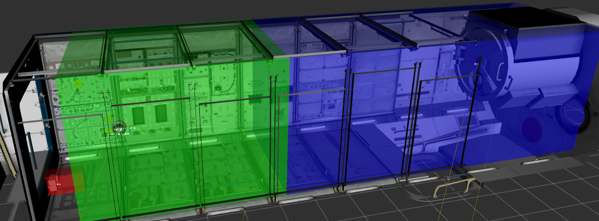
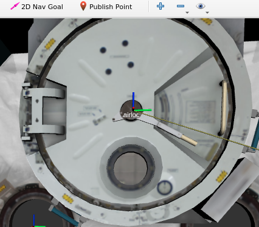
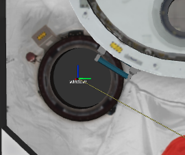
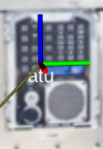

# RoboCup@Space Score Manager

## このパッケージについて
- 宇宙ステーション船内の自律的な点検・確認タスクの自動採点システムです。

### セットアップ方法
1. ROSの`src`フォルダに移動します．
    ```sh
    $ cd ~/{rosのワークスペース}/src/
    ```

2. 本パッケージをcloneします．
    ```sh
    $ git clone https://github.com/RoboCupAtSpaceJP/rcjp_space_2026.git -b feat/score_manager
    ```

3. パッケージをコンパイルします．
   ```bash
   $ cd ~/{rosのワークスペース}/
   $ catkin_make
   $ source ~/{rosのワークスペース}/devel/setup.bash
   ```

### スコアマネージャーの起動方法

```bash
roslaunch robocup_atspace_score_manager atspace_score_manager.launch
```
### 各エリアについて

- 上記の画像のようなエリアがそれぞれ、ドッキングエリア（赤）、ナビゲーションエリア（緑）、点検エリア（青）となります。

### 対象物体について
- 固定対象物体

  - airlock
    - 

  - window
    - 

  - atu (Audio Terminal Unit)
    - 

- 可搬対象物体（TODO）


### 起動後の流れ
- 競技者は起動後に競技のプログラムを実行します。10分の時間制限が設けられ、タスクを完遂、または10分をすぎるとスコアマネジャーは終了します。

- スタートタスク
  - 最初にスコアマネージャーが撮影対象(例: Please take the object)を提示し、競技者からのサービスコールを待機します。
    - サービス名：`/start_competiiton`、　型：`std_srvs/Trigger`、　スコアマネージャーはレスポンスの`message`欄に撮影対象を含んだ文章を提示。
  - その後、ロボットがドッキングエリアを自律的に離脱すると得点が加点されます。
- ナビゲーションタスク(往路)
  - ロボットはナビゲーションエリアを通過し、点検エリアへ到達すると得点が加点されます。
  この際、障害物を回避するとさらに加点されます。また、安全距離を維持することで安全ボーナスが加点されます。（TODO）
- 点検タスク
  - 点検タスクではロボットが対象物を正しく撮影したことをスコアマネージャーに報告する必要があります。
     - サービス名： `/capture_report`、　型：`robocup_atspace_score_manager/CaptureReport`、　競技者は`target_object_name: {撮影する物体名}`を送信、　スコアマネージャーはレスポンスの`message`欄に撮影の成否結果を提示。撮影する物体名は`rules.yaml`に書いてある名前と一致させる必要があります。2回サービスコールすると撮影の成否に関わらず次のタスクへ遷移します。
  - 固定対象物か可搬対象物を条件を満たして撮影することで得点が加点されます。
  - 条件
    1. 距離条件
       - ロボットと物体の座標間の直線距離が`distance_threshold`以内であること
    2. 向きの条件
       - ロボットの正面ベクトルと物体方向ベクトルの内積が`dot_product_threshold`以上であること
- ナビゲーションタスク(往路)
  - ロボットはナビゲーションエリアを通過し、ドッキングエリアへ到達すると得点が加点されます。
  この際、障害物を回避するとさらに加点されます。また、安全距離を維持することで安全ボーナスが加点されます。（TODO）
- ドッキングタスク
    - ドッキングステーションへ自律ドッキングすることができると加点されます。（TODO）
- 時間ボーナス
    - 時間制限(10分) - タスク完了時間分、点数が加点されます。（最大10点）（TODO）

### コンフィグファイルの設定方法
- このパッケージにはコンフィグファイルが2つあります。`rules.yaml`ではエリア範囲や点数などが定義されており競技者は基本的に編集しないファイルです。
競技者は`competition.yaml`を編集していただきます。
`team_name`に競技者のチーム名を設定すると`scores`フォルダに競技のスコアが記録されます。`fixed_object_name`には固定対象物体名、`portable_object_name`には可搬対象物体名を設定してください。`target_object_name`には`rules.yaml`で定義している対象物体名を設定してください。

<details>
<summary>設定例 </summary>

```yaml
competition:
  team_name: "teamA"
  trial_number: 1
  stage: 1
  target_object_type: "fixed"
  target_object_name: "airlock"
  time_limit: 600
```
</details>


### TODO
- 障害物を回避した際の追加点の実装
- 安全距離の維持による追加点の実装
- 未知物体の対応
- ドッキングステーションへ自律ドッキングした際の追加点の実装
- 時間ボーナス
