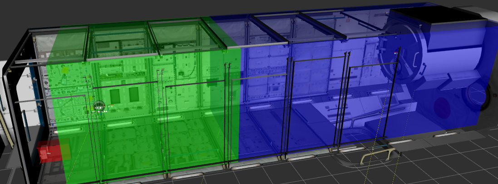
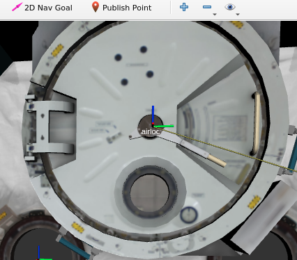
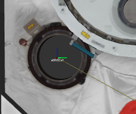
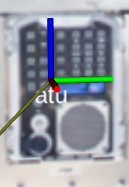
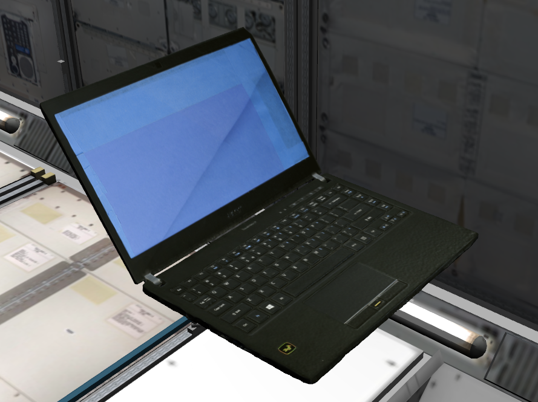
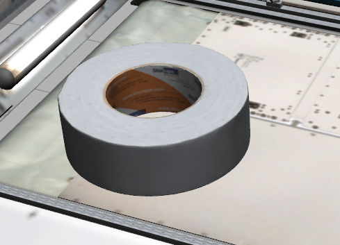
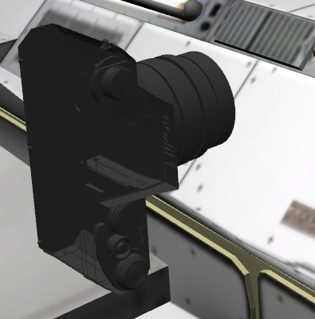

# RoboCup@Space Score Manager

## このパッケージについて
- 宇宙ステーション船内の自律的な点検・確認タスクの自動採点システムです。

### セットアップ方法
- Int‑Ball2 シミュレータ Docker環境以外での動作確認はできていません。理論上は動作します。
1. ROSの`src`フォルダに移動します．
    ```sh
    $ cd /home/nvidia/IB2/Int-Ball2_platform_simulator/src
    ```

2. 本パッケージをcloneします．
    ```sh
    $ git clone https://github.com/RoboCupAtSpaceJP/rcjp_space_2026.git -b feat/score_manager
    ```

3. パッケージをコンパイルします．
   ```bash
   $ cd /home/nvidia/IB2/Int-Ball2_platform_simulator
   $ catkin_make
   $ source /home/nvidia/IB2/Int-Ball2_platform_simulator/devel/setup.bash
   ```

### スコアマネージャーの起動方法

```bash
roslaunch robocup_atspace_score_manager atspace_score_manager.launch
```
### 各エリアについて

- 上記の画像のようなエリアがそれぞれ、ドッキングエリア（赤）、ナビゲーションエリア（緑）、点検エリア（青）となります。

### 対象物体について
- 固定対象物体

  - airlock
    - 

  - window
    - 

  - atu (Audio Terminal Unit)
    - 

- 可搬対象物体

  - laptop
    - 
  - tape
    - 
  - camera
    - 

  - ※現在、cameraのモデルが半透明になってしまっています。(TODO)

### 起動後の流れ
- 競技者はシミュレーター起動後にスコアマネージャーを起動し、その後、競技のプログラムを実行します。
  - スコアマネージャーを起動後、宇宙飛行士や可搬対象物が出現します。

- スタートタスク
  - 最初にスコアマネージャーが撮影対象(例: Go to the inspection area, take pictures of 〇〇 (固定対象物) and 〇〇 (可搬対
象物), and return.)を提示し、競技者からのサービスコールを待機します。
  - サービス名：`/competition_start`、　型：`std_srvs/Trigger`、　スコアマネージャーはレスポンスの`message`欄に撮影対象を含んだ文章を提示。
    - 例
        ```sh
        rosservice call /competition_start "{}"
        ```
  - スコアマネージャーはサービスコールを受信したら、時間の計測を開始します。タスクを完遂、または[competition.yaml](config/competition.yaml)の`time_limit`で定義した時間制限をすぎるとスコアマネジャーは終了します。
  - その後、ロボットがドッキングエリアを自律的に離脱すると`scores.yaml`に得点が加点されます。
- ナビゲーションタスク(往路)
  - ロボットはナビゲーションエリアを通過し、点検エリアへ到達すると得点が加点されます。
  この際、障害物を回避するとさらに加点されます。障害物を回避しても壁に衝突した場合、障害物回避分の加点はされません。
  - 安全距離を維持することで安全ボーナスが加点されます。（TODO）
- 点検タスク
  - 点検タスクではロボットが対象物を正しく撮影したことをスコアマネージャーに報告する必要があります。
     - サービス名： `/report_capture`
     - 型：`robocup_atspace_score_manager/CaptureReport`
     - 競技者は`target_object_name: {撮影する物体名}`を送信、　スコアマネージャーはレスポンスの`message`欄に撮影の成否結果を提示。
     - 撮影する物体名は`rules.yaml`に書いてある名前と一致させる必要があります。
     - 例
        ```sh
        rosservice call /report_capture "target_object_name: 'laptop'" 
        ```
  - 固定対象物か可搬対象物を条件を満たして撮影することで得点が加点されます。
    - 条件
      1. 距離条件
        - ロボットと物体の座標間の直線距離が`rules.yaml`の`distance_threshold`以内であること
      2. 向きの条件
        - ロボットの正面ベクトルと物体方向ベクトルの内積が`rules.yaml`の`dot_product_threshold`以上(0.866以上、角度にして30度以内)であること
- ナビゲーションタスク(復路)
  - ロボットはナビゲーションエリアを通過し、エリア外(点検エリア以外)に出ると得点が加点されます。この際、障害物を回避するとさらに加点されます。障害物を回避しても壁に衝突した場合、障害物回避分の加点はされません。
  - ナビゲーションエリアを離脱し点検エリアへ再侵入した場合、ナビゲーションエリアを通過したとはみなせないため、得点は加算されません。
  - 安全距離を維持することで安全ボーナスが加点されます。（TODO）
- ドッキングタスク
    - ドッキングエリアに到達すると加点されます。
- 時間ボーナス
    - 競技にかかった時間は、`score.yaml`の`elapsed_time`に記録されます。
      - 競技開始call送信後から、競技終了までの現実時間が計測されています。
      - この時間をもとに各自時間ボーナスを計測してください。

### コンフィグファイルの設定方法
- このパッケージにはコンフィグファイルが2つあります。
- `rules.yaml`
  - エリア範囲や点数などが定義されており競技者は基本的に編集しないファイルです。
  - 障害物(宇宙飛行士)や可搬対象物のモデルや出現位置、角度なども変更できます。
- `competition.yaml`
  - 競技者が編集するファイルです。
  - `team_name`に競技者のチーム名を設定すると`scores`フォルダに競技のスコアが記録されます。`fixed_object_name`には固定対象物体名、`portable_object_name`には可搬対象物体名を設定してください。対象物体名は`rules.yaml`で定義している対象物体名を設定してください。

<details>
<summary>設定例 </summary>

```yaml
competition:
  team_name: "teamA"
  trial_number: 1
  stage: 2
  fixed_object_name: "airlock"
  portable_object_name: "camera"
  human_assignments:  # 人間障害物の配置設定（最大2人）
    human_pos_1: "" # 見た目を変えたい場合は、rules.yamlに定義したテンプレート名（person_a 等）を記述します。
    human_pos_2: "person_b" # 出現させたくない場所は "" (空文字) または null にします。
  time_limit: 900
```
</details>

## 新規モデルの追加方法
宇宙飛行士や可搬対象物のモデルは`models`ディレクトリに配置してください。
その後、`rules.yaml`の`portable_objects`や`human_templates`に追加した後、`competition.yaml`を書き換えてlaucnhを実行してください。

### TODO
- 安全距離の維持による追加点の実装
- cameraのモデルが半透明になっている問題の修正
- 時間ボーナスの自動計算